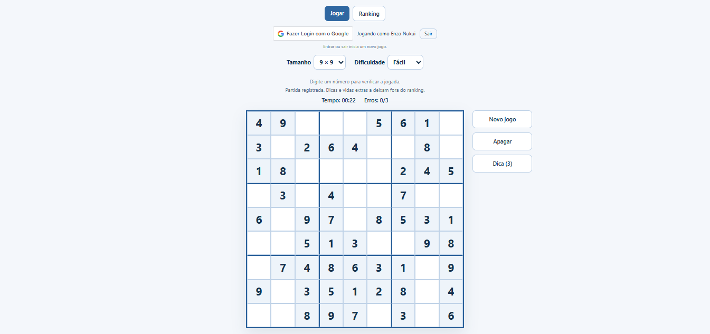
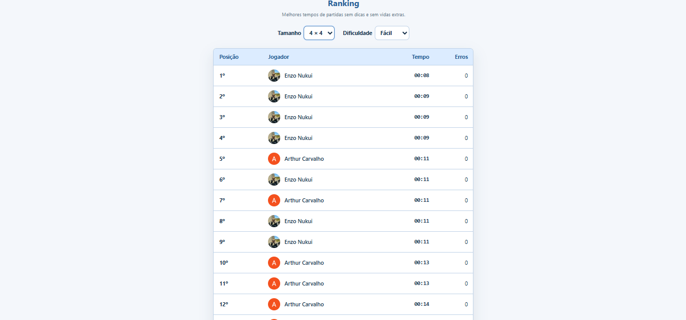
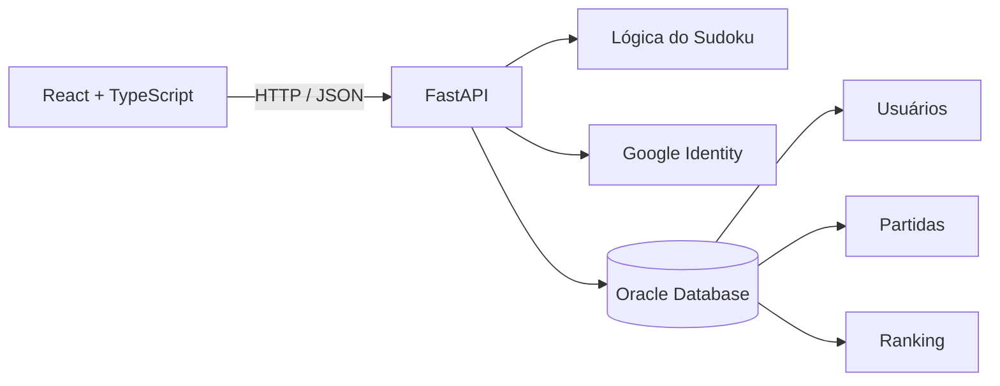

<div align="center">

# Sudoku

Aplicação full stack de Sudoku com geração dinâmica de partidas, múltiplos tamanhos e dificuldades, autenticação com Google e ranking de jogadores.

[](https://www.python.org/)
[](https://fastapi.tiangolo.com/)
[](https://react.dev/)
[](https://www.typescriptlang.org/)
[](https://www.oracle.com/database/)
[](https://vercel.com/)

### [Jogar online](https://ende-sudoku.vercel.app/) · [Repositório](https://github.com/EnzoNukui/sudoku)

</div>

---

## Preview

<p align="center">
  
  
</p>

---

## Sobre o projeto

Este projeto começou como uma implementação de **Sudoku em Python executada pelo terminal** e evoluiu para uma aplicação web completa, conectando **frontend, backend, banco de dados, autenticação e deploy**.

A lógica do jogo gera tabuleiros dinamicamente por meio de **backtracking**, aplica diferentes níveis de dificuldade e suporta três formatos de jogo: **4x4, 6x6 e 9x9**.

A versão web utiliza uma API própria para controlar partidas, validar jogadas, fornecer dicas, registrar resultados e montar o ranking. Jogadores autenticados com Google podem registrar suas partidas no banco de dados e competir pelos melhores tempos.

### Evolução do projeto

```text
Sudoku em Python no console
          ↓
Geração dinâmica de tabuleiros
          ↓
Separação da lógica do jogo
          ↓
API REST com FastAPI
          ↓
Frontend com React + TypeScript
          ↓
Autenticação com Google
          ↓
Persistência em Oracle Database
          ↓
Ranking de jogadores
          ↓
Deploy completo na Vercel
```

---

## Funcionalidades

- Tabuleiros **4x4**, **6x6** e **9x9**.
- Três níveis de dificuldade: **Fácil**, **Médio** e **Difícil**.
- Geração automática de novas partidas.
- Solução gerada por algoritmo de **backtracking**.
- Validação de linha, coluna e bloco.
- Validação de jogadas em tempo real através da API.
- Cronômetro de partida.
- Limite inicial de **3 erros**.
- Sistema de **3 dicas por partida**.
- Possibilidade de adicionar uma vida após uma derrota.
- Login utilizando **Google Identity Services**.
- Partidas disponíveis também para visitantes, sem necessidade de login.
- Registro de usuários e partidas em **Oracle Database**.
- Ranking separado por tamanho de tabuleiro e dificuldade.
- Ranking baseado no menor tempo concluído.
- Partidas com dicas ou vidas extras não entram no ranking.
- Interface responsiva para diferentes tamanhos de tela.

---

## Como funciona

A aplicação foi dividida em três partes principais:



### Frontend

O frontend é responsável pela experiência do jogador. Ele controla a interface, seleção de tamanho e dificuldade, cronômetro, navegação, estado visual do tabuleiro e comunicação com a API.

### Backend

O backend expõe uma API REST construída com FastAPI. A API cria partidas, valida jogadas, gerencia dicas e vidas extras, autentica usuários e registra o progresso das partidas.

### Lógica do Sudoku

A lógica principal permanece separada da API. O jogo cria um tabuleiro vazio, gera uma solução válida utilizando backtracking, mantém uma cópia da solução e remove números de acordo com a dificuldade escolhida.

| Dificuldade | Células removidas |
| --- | ---: |
| Fácil | ~40% |
| Médio | ~50% |
| Difícil | ~60% |

### Banco de dados

O Oracle Database armazena usuários autenticados, partidas e o estado necessário para manter os jogos. O ranking considera apenas vitórias concluídas **sem dicas e sem vidas extras**.

---

## Tecnologias

### Frontend

- **React 19**
- **TypeScript 6**
- **Vite 8**
- **React Router**
- **Tailwind CSS 4**
- **Google Identity Services**

### Backend

- **Python 3.12+**
- **FastAPI**
- **Pydantic**
- **Google Auth**
- **python-oracledb**
- **python-dotenv**

### Banco de dados

- **Oracle Database**
- SQL
- Connection pool com `python-oracledb`

### Deploy

- **Vercel**

---

## Estrutura do repositório

```text
sudoku/
│
├── console/
│   └── sudoku_console.py
│
├── back-end/
│   ├── sudoku_api.py
│   ├── sudoku_db.py
│   ├── sudoku_logica.py
│   ├── schema.sql
│   ├── requirements.txt
│   └── pyproject.toml
│
├── front-end/
│   └── tabuleiro_sudoku/
│       ├── src/
│       │   ├── components/
│       │   ├── pages/
│       │   ├── services/
│       │   ├── App.tsx
│       │   └── main.tsx
│       ├── package.json
│       └── vite.config.ts
│
├── docs/
│   └── images/
│       ├── sudoku-game.png
│       └── sudoku-ranking.png
│
└── vercel.json
```

### Principais arquivos

| Arquivo | Responsabilidade |
| --- | --- |
| `console/sudoku_console.py` | Primeira versão jogável do Sudoku pelo terminal. |
| `back-end/sudoku_logica.py` | Regras, geração, validação e solução dos tabuleiros. |
| `back-end/sudoku_api.py` | API REST, autenticação e controle das partidas. |
| `back-end/sudoku_db.py` | Comunicação e persistência no Oracle Database. |
| `back-end/schema.sql` | Estrutura das tabelas e regras do banco. |
| `src/services/sudokuApi.ts` | Comunicação do frontend com a API. |
| `src/pages/Home/Home.tsx` | Tela principal do jogo. |
| `src/pages/Ranking/Ranking.tsx` | Tela de classificação dos jogadores. |

---

## API

A API utiliza o prefixo `/api`.

| Método | Endpoint | Descrição |
| --- | --- | --- |
| `GET` | `/api` | Verifica se a API está disponível. |
| `POST` | `/api/novo-jogo` | Cria uma nova partida. |
| `POST` | `/api/verificar-jogada` | Valida um número informado pelo jogador. |
| `POST` | `/api/verificar-tabuleiro` | Verifica se o Sudoku foi concluído. |
| `POST` | `/api/dica` | Preenche uma célula válida como dica. |
| `POST` | `/api/reiniciar-dicas` | Reinicia a partida após seu encerramento. |
| `POST` | `/api/adicionar-vida` | Adiciona uma vida depois de uma derrota. |
| `POST` | `/api/auth/google` | Valida a credencial Google e cria uma sessão. |
| `GET` | `/api/ranking` | Retorna o ranking por tamanho e dificuldade. |

Exemplo de criação de partida:

```json
{
  "tamanho": 9,
  "dificuldade": "dificil"
}
```

---

## Executando localmente

### Pré-requisitos

Antes de começar, tenha instalado:

- Python **3.12 ou superior**
- Node.js e npm
- Acesso a um **Oracle Database**
- Credenciais OAuth do Google, caso queira utilizar o login

### 1. Clone o repositório

```bash
git clone https://github.com/EnzoNukui/sudoku.git
cd sudoku
```

### 2. Configure o backend

Entre na pasta:

```bash
cd back-end
```

Crie e ative um ambiente virtual:

```bash
python -m venv .venv
```

Windows:

```bash
.venv\Scripts\activate
```

Linux/macOS:

```bash
source .venv/bin/activate
```

Instale as dependências:

```bash
pip install -r requirements.txt
```

Crie um arquivo `.env` dentro de `back-end/`:

```env
ORACLE_USER=seu_usuario
ORACLE_PASSWORD=sua_senha
ORACLE_DSN=seu_dsn
GOOGLE_CLIENT_ID=seu_google_client_id
SESSION_SECRET=uma_chave_secreta_segura
```

Crie/verifique as tabelas do banco:

```bash
python sudoku_db.py criar
```

Para testar a conexão:

```bash
python sudoku_db.py testar
```

Inicie a API:

```bash
uvicorn sudoku_api:app --reload
```

A API ficará disponível em:

```text
http://127.0.0.1:8000/api
```

### 3. Configure o frontend

Em outro terminal:

```bash
cd front-end/tabuleiro_sudoku
npm install
```

Crie um arquivo `.env`:

```env
VITE_API_URL=http://127.0.0.1:8000/api
VITE_GOOGLE_CLIENT_ID=seu_google_client_id
```

Inicie o frontend:

```bash
npm run dev
```

A aplicação será disponibilizada pelo Vite, normalmente em:

```text
http://localhost:5173
```

> O login Google é opcional para jogar. Sem autenticação, o usuário consegue iniciar partidas normalmente, mas seus resultados não são registrados no ranking.

---

## Versão em console

O diretório `console/` mantém a primeira versão do projeto, desenvolvida totalmente em Python para execução pelo terminal.

Ela foi importante para construir e validar os principais conceitos antes da criação da aplicação web:

- criação do tabuleiro;
- validação de linhas, colunas e blocos;
- localização de células vazias;
- geração da solução com backtracking;
- remoção de números conforme a dificuldade;
- identificação de células fixas;
- realização e exclusão de jogadas.

Para executá-la:

```bash
cd console
python sudoku_console.py
```

---

## Regras do ranking

Para que uma partida apareça no ranking:

1. O jogador deve estar autenticado com uma conta Google.
2. A partida precisa terminar em vitória.
3. Nenhuma dica pode ter sido utilizada.
4. Nenhuma vida extra pode ter sido utilizada.

Os rankings são separados por **tamanho do tabuleiro** e **dificuldade**, permitindo comparações entre partidas equivalentes.

---

## Principais aprendizados

O desenvolvimento deste projeto envolveu diferentes etapas de uma aplicação full stack e permitiu trabalhar com:

- algoritmos recursivos e **backtracking**;
- organização e reutilização de regras de negócio;
- desenvolvimento de uma **API REST**;
- integração entre React e um backend Python;
- tipagem com TypeScript;
- autenticação OAuth com Google;
- controle de sessão no backend;
- integração e persistência com Oracle Database;
- modelagem de usuários, partidas e ranking;
- uso de variáveis de ambiente;
- deploy de frontend e backend em uma mesma aplicação.

---

## Status

O projeto está funcional e disponível online. Novas melhorias podem ser adicionadas conforme a evolução da aplicação.

**Demo:** https://ende-sudoku.vercel.app/

---

## Autor

Desenvolvido por **Enzo Nukui**.

- GitHub: [@EnzoNukui](https://github.com/EnzoNukui)
- LinkedIn: [linkedin.com/in/enzo-nukui](https://www.linkedin.com/in/enzo-nukui/)

---

<div align="center">

Projeto desenvolvido para aplicar, em uma única solução, conceitos de **algoritmos, frontend, backend, APIs, banco de dados, autenticação e deploy**.

</div>
